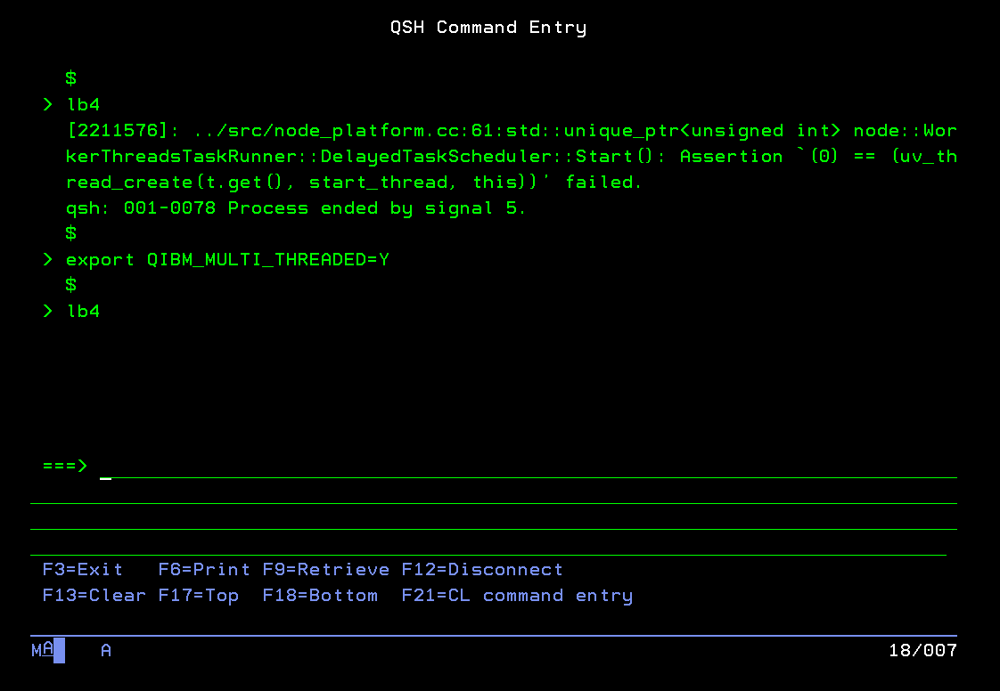

# Connecting to our IBM i Profiles through SSH

For this lab, we will be using a system provided by COMMON Europe. I will provide you with the IP address and login instructions on the data of the workshop.

When we connect to our IBM i systems to develop open-source software, or run our open-source software, or simply interact with the IFS, we are going to do it in a way that may feel foreign to you: An SSH connection and a "normal" shell like `bash`.

What is SSH? SSH stands for "Secure SHell", and it is a protocol for secure communication between systems. We will be using SSH to create secure connections with our system to run commands in a `bash` shell session. SSH and SSH keys are also used for other uses, like securely pushing your code to GitHub from the command line, or syncing files between systems.

Now, I know what you are thinking: Why do I need to use SSH + `bash`? I have a 5250 emulator that works great, and I can just use QSH! Unfortunately, the 5250 environment and QSH are not "normal", and open-source software developers are targeting other configurations (a "modern" terminal running `bash`). Qshell may run fine 80% of the time, but if you are serious about developing open-source applications, you are going to need to get comfortable with SSH + `bash`.

Furthermore, the framework we will be using today, LoopBack, _will not work with QP2TERM or QShell_. We will make extensive use of the LoopBack CLI (command line interface), and it expects that you are running in a "normal" terminal. If you try to use it with QSH, it will just hang!



There is also a hidden bonus of doing things this way: You will be able to hire any developer who has worked on open-source software on Linux (or other terminal-heavy Unix systems), and be able to get them productive on IBM i from day 1. In fact, there are stories of new developers doing open-source work with SSH + `bash` on IBM i for months before realizing they weren't on a Linux system!

If you want to know more about why SSH should your preferred way of connecting to IBM i for doing PASE/open-source work, check out this blog from the wizard of IBM i open-source, Jesse Gorzinski: https://techchannel.com/Trends/08/2017/embrace-ssh

Unfortunately, the instructions for creating an SSH connection are different depending on which operating system you are running. Go to the section below that is for your operating system.

### **Mac and Linux**

For Unix systems (Linux, Mac, etc.), you probably have OpenSSH (or something similar) already installed. You should be able to connect to the system simply by opening the terminal on your system and running a command like:

```
ssh username@system
```

When you run the command, you will prompted for that password. When you enter your password correctly, you will be logged onto the IBM i system.

Using a username and passowrd is _okay_, but if you really want to be an open-source developer, you should really be using SSH _keys_. SSH keys are a pair of tokens that are used to authenticate you as a user. One of the keys is a public key that you share with others, while the other is a private key that you **never** share with others. Basically, the public key is used to encrypt, while the private key is used to decrypt. This encryption strategy is used both to authenticate a user, as well as to create an encrypted connection between systems. It is generally regarded as more secure than simply using a username/password combination to log onto a server. (If you want to read more about all of this, I have found this page to be a good resource: https://jumpcloud.com/blog/what-are-ssh-keys)

To generate keys, we are going to use the `ssh-keygen` tool that should (probably) exist on your system:

```bash
ssh-keygen -t rsa -b 4096
```

This will create keys for you in your `~/.ssh` directory name `id_rsa` and `id_rsa.pub`. The one ending in `.pub` is of course your public key, and the other is your private key.

In order to simplify our logon to the system, we are going to create another file in the `.ssh` directory named `config`. In this file, we can create an alias for the system we want to connect to so we don't have to type out the entire system name each time. We can also use this file to tell SSH that we want to forward our SSH keys, so we can use them from the IBM i without having to manually transfer them. Create this `config` file if it doesn't already exist, and add:

```
Host commoneu
  HostName systemname
  User username
  ForwardAgent yes
  ServerAliveInterval 5
```

Remembering to replace the `systemname` and `username` with the system I tell you to use and whatever username you were assigned. Now, you should be able to log onto the system by using:

```
ssh commoneu
```

But wait, you still had to enter your password! No worries, we simply have to copy our public key to the IBM i system so that it can do the cryptographic handshake:

```
ssh-copy-id -i ~/.ssh/id_rsa.pub username@systemname
```

After entering that command, you should now be able to log onto your system in a way that is more secure than using a username and password and with less typing:

```
ssh commoneu
```

Voila! You are now an SSH expert!

### **Windows**

For Windows, logging on using SSH is a little trickier. If you have a shell already set up, you can use what you know. If you have Access Client Solutions (ACS) installed, you can try creating a configuration for the lab system and running `SSH Terminal` in ACS and see what happens.

If none of that applies, the most common solution is to download PuTTY: https://www.chiark.greenend.org.uk/~sgtatham/putty/

PuTTY is an implementation of SSH for Windows, and will allow you to enter a system name and configure a user name and password.

If you are having any problems, don't hesitate to ask. I know SSH from Windows can be difficult and confusing, but once we get it working we don't have to worry about it anymore!

If you read the Linux and MacOS instructions above, you will see that we generate keys and forward those keys and have aliases set up and all of that fun stuff. Configuring all of that on Windows is a real pain, so for that lab I just recommend getting PuTTy set up and then working from there.

---

Now, if you log onto the system, you should be placed in your home directory (something like `/home/<userid>/`). You will also be given `bash` as your default shell. What is bash? Read on!

---
Next: [Running our Commands with Bash](c.bash.md)