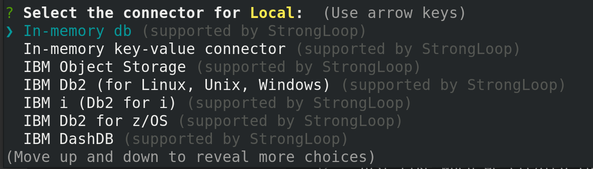

# Setting up our DataSource with the `lb4` CLI

So far, our application only has one endpoint, and it doesn't even connect to a datasource. To make our REST API actually functional, we need to tell it what datasource we want to use, and how it can connect to that datasource. For us IBM i developers, that datasource will mostly likely be Db2 for i.

To create a datasource, we will again use the `lb4` CLI. When we run the command to create a datasource, it will ask us what type of connector we want to use, and then download it for us. For IBM i, this connector will use ODBC as its mechanism for connecting to the system.

## ODBC

---
_This part of the workshop will primarily be given as a presentation._
_ODBC, the ODBC driver, and a DSN for your to use will already be installed and configured for you for this lab. This information is still important to know!_

If you want to skip this section and just keep working, go to [Back to LoopBack](#back-to-loopback)

---

The overwhelming majority of open-source software delivered on the system was developed by people who have no idea what IBM i is, and there are no "built-in" mechanisms to connect them to things like Db2 for i, RPG programs, or running CL commands. For IBM i users, this presents a problem: As cool and modern as open-source languages, runtimes, and utilities may be, they aren't really useful if they can't integrate with your core business applications. Instead, we need to develop a strategy to connect to underyling IBM i resources, one that can reuse no matter what technology we are trying to connect to IBM i.

There are a number of ways to accomplish this, but the IBM i Open-Source Software Team's preferred method is through ODBC (Open Database Connectivity). ODBC is a generic database interface developed Microsoft that allows any database with an ODBC driver to use the same C APIs and libraries. So what does that mean, and why does it matter? There are two important benefits that ODBC provides over something like a native Db2 for i connector.

1. IBM has developed Db2 for i ODBC drivers for all major operating systems (Mac, Windows, Linux, AND IBM i). That means you can develop an ODBC application on any of those operating systems, then move it to another one and it will just work. The only thing you may have to change is the connection string, if you are moving from a non-IBM i system to IBM i, or vice versa.
2. ODBC connectors are widely available for almost every open-source runtime/language, so you don't have to wait for IBM to implement something before you can use new open-source software. For instance, PHP comes with an `odbc` connector. Python has `pyodbc`. Node.js, as you will see (and experience) below, has `odbc` that you can download from NPM. It is a technology that has a large user base, and so it can be found almost everywhere.

When you are using open-source software on IBM i (or _with_ IBM i) and you are wondering how to connect to the database, I hope you first thought is: "How can I use ODBC with this?"

### Installing ODBC on IBM i

To install the ODBC driver and driver manager on IBM i, it used to be the case that you had to go to the ACS website, agree to a bunch of licenses, download a zip file, extract, move it to your IBM i system, and then install that file with Yum. That is no longer the case, and you can simply run:

```
yum install ibm-iaccess
```
When you install this package, yum will:
* Install the IBM i Access ODBC driver
* Install the unixODBC driver manager
* Register the driver with the driver manager by putting the appropriate information in the odbcinst.ini file (see using).
* Create a datasource name (DSN) for your local system called *LOCAL.

Hopefully I gave my little presentation before the start of the workshop so you know what all of this means. But basically, it automatically ensures that you have everything you need to start connecting to your Db2 for i database and start doing some work!

### Other Systems

In this workshop we are only going to be using ODBC on IBM i to connect locally to Db2 for i on the same system. If you want to learn about how to connect from another operating system (probably whatever your workstation/laptop is running), please consult our documentation:

* [Installing on Windows](https://ibmi-oss-docs.readthedocs.io/en/latest/odbc/installation.html#windows)
* [Installing on Linux](https://ibmi-oss-docs.readthedocs.io/en/latest/odbc/installation.html#linux)
* [Installing on MacOS](https://ibmi-oss-docs.readthedocs.io/en/latest/odbc/installation.html#macos)

## Back to LoopBack

Ok, now that you know what ODBC is, and now that we have ODBC installed on our system, including the `*LOCAL` DSN for connecting to the local database, we can go about creating our datasource! As you might have guessed, all we have to run is:

```bash
lb4 datasource
```

Just like when we created the application, the CLI will walk us through all of the options that we need to add to create our datasource:

```
? Datasource name: 
```
This can be anything we want, but since we are just going to be connecting to the local Db2 database, I think "Local" is a sensible name.

```
? Select the connector for Local:  (Use arrow keys)
```

Again, we are given a selection prompt that we can navigate around in. We need to press the arrow keys to go up and down to find the connector that we want to use for connecting to our data source. I'll give you one guess which one we want...

`IBM i (Db2 for i)`!

Once you select that datasource, it will continue to prompt you for options specific to our data source. Because we are using ODBC, it will ask questions about setting up an ODBC connection:

```
? ODBC DSN:
```
In this prompt, provide nothing. It would be great if we could provide `*LOCAL`, but there is a bug in the connector that only accepts values from the next question. I will fix after the conference.

```
? ODBC connection string for overriding other options (e.g.: DBQ=QGPL;NAM=1):
```

For our connection string, we can provide the value `DSN=*LOCAL;`. This will make your DataSource connection use a system-wide DSN that uses `*CURRENT` credentials, meaning the REST API will run under the same authority as the user profile that is running the process (in this case, our LoopBack application).

Once you hit "Enter", you will prompted for additional connection string options that you can add. For all of these, you can just press "Enter" to leave them blank. Our DSN will do all of the heavy lifting for us, and we don't need any additional options for now.

``` 
? IBM i User (If not specified in DSN or connection string): 
? IBM i User's Password (If not specified in DSN or connection string): [hidden]
```

Just like when we created our app, the CLI will generate a file for us. However, there is one more step that we have to do before our datasource can be used: We need to compile our program.

```bash
$ npm run build
```

We now have the framework for a LoopBack application, and a datasource that allows our LoopBack application to connect to Db2 for i. We can finally start creating our models and (eventually) migrating them to the database!

---
Next: [Creating Models](f.loopback-models.md)