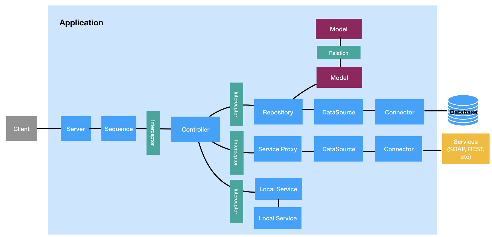

# Creating Models with the `lb4` CLI

The LoopBack documentation has a very good explanation of models. If something I write below doesn't make sense, or you just want to learn more, feel free to read them!

https://loopback.io/doc/en/lb4/Model.html

---



Recall that for our workshop we are going to be making a REST API to serve our fictional bookstore, Benelux Books. The first step for creating our REST API is to define the models that are needed to run our bookstore.

In LoopBack, a model represents a "business domain object", a structure that has a set of values that represent some _thing_ that we want to interact with using our REST API. These models are implemented in TypeScript files which define the _shape_ of the data (what properties exist in that model, and what types of values are expect for each property). When we send and receive data from our REST API, we do so with JSON strings, the shapes of which is highly dependent on the shapes of our models.

Typically, each model is backed by a table in our datasource, and each property in the model is mapped to a field in the table. When we create, read, update, or delete (CRUD) instances of our model, what we are doing under the covers is creating, reading, updating, and deleting rows in our database.

This will all make much more sense as we continue to create our REST API, but just know that the model is a very important part of our equation, and will form the backbone of how our data _looks_.

## Benelux Books Models

Let's look at some models that we might need to run our bookstore:

* **Customer**: Information about a customer. The properties our model needs includes their name (first, last), their address (street, house number, city, country), maybe some simulated payment information (credit card number)? We could also pretend we have a "loyalty club", and track how many points our users have collected through their purchases (points available, lifetime points). We then also want to associate our customers with any **Orders** that they make.

* **Order**: We want to track the orders that are made to our bookstore. Properties that we probably want to include are the books that comprise the order (and their quantities), the customer who made the order, and the order datetime.

* **Book**: We are a bookstore, so of course we need to keep track of our books. Each book has a title, a published date, at least one **Author**, and a price that we charge when people buy that book.

* **Author**: Each author has a name of course. And also, each **Author** might write one or more **Books**. For our purposes, that is the only information we will record for our authors.

### Relationships

You will notice that just like rows in different database tables, there are often relationships between models and their instances. For our data model, we have:

1. **`Customer`** has many **`Orders`**
2. **`Order`** has one **`Customer`**
3. **`Order`** has many **`Books`**
4. **`Books`** has many **`Authors`**
5. **`Authors`** has many **`Books`**

It is important that we lay out our relationships so that we know what sorts of foriegn keys we have to had in our source models. For instance, each order belongs to one customer, so each order should also have some sort of `customerId` field.

You might also notice that we define that a Customer has many Orders (1), but also that a Order has a Customer (2). Isn't that redundant? Well, not really. These definitions will define what we can do with our REST API. Since we want to be able to both:

1. Get all of the **`Orders`** of a **`Customer`**, and
2. Get the **`Customer`** for a given **`Order`**

We need to define _both_ of those relationships to get that functionality in our REST API. It will make more sense when we actually go to create the relationships.

Implementing that an order has many books (relationship 3) should be easy enough, but we will need to have a intermediate "pivot" table (and therefore an intermediate model) to make that definition. The reason we do this is the relationship is really a "many-to-many" relationship, but in this case we don't really care to get all of the **`Orders`** that a **`Book`** is part of, only the other way around. To accomplish this relationship, we will have to create a new model, which we can call `OrdersBooks` (or something similar), that has an `id` of its own, then a `orderId` property and a `bookId` property that are foreign keys to the primary keys on our **`Order`** and **`Book`** models.

Our final relationships are that (4) a **`Book`** has many **`Authors`** (a book can be written by one or more people), and that (5) an **`Author`** has many **`Books`** (an author can write more than one book). Again, we will need another model, which we can call **`AuthorsBooks`**, that again will need its own `id` property, and a `authorId` and `bookId` property.

Whew! We have six models, and five relationships! You can see why it was important that we wrote out our models before we started creating them! It can be difficult to modify these things after you create them, so it always worth the time to sketch out your models, just like your database tables.

When are we going to define all of these relationships? Well, LoopBack won't let us do that until we have created Repositories for our Models, so we will wait until we have everything else set up with our Models before we worry about the relationships.

## Creating our Models

If we had to write our Models by hand, it would take up the entire workshop. Luckily, the CLI has an option that will help us create Models with simple prompts like we are used to seeing!

Let's get started creating our Models!

```bash
$ lb4 model
```
Let's begin by creating our Customer first. When we call our CLI with the `model` option, we are again prompted for information.

```
? Model class name:
```

Here, we can just say `Customer`, since that's the name of our Model.

```
? Please select the model base class 
❯ Entity (A persisted model with an ID) 
  Model (A business domain object) 
```

Here, we should use `Entity` as the base class, becuase we want our Customer have an ID and be persisted in the database.

```
? Allow additional (free-form) properties? (y/N)
```

You can hit "Enter" to select the default option of No. We don't want to worry about handling additional information our user might pass, so it is best to just stick to the properties we define.

```
Model Customer will be created in src/models/customer.model.ts

Let's add a property to Customer
Enter an empty property name when done

? Enter the property name:
```

Now we get to start making the properties that will actually exist on our Customer. From the data model outlined above, I think we need the following (and their types):

**`Customer`**:
```
id:                 number     (required) (ID) (auto-generated)
firstName:          string     (required)
lastName:           string     (required)
address:            string     (required)
city:               string     (required)
country:            string     (required)
creditCard:         number (NOT required) (NO default)
loyaltyPoints:      number (NOT required) (NO default)
totalLoyaltyPoints: number (NOT required) (NO default)
```

For each property, enter its name, select its type, and then answer the remaining questions. Only the `id` should have `Is id the ID property?` set to yes, and you should tell it to be auto-generated. Every property should be required, except for `creditCard`, `loyaltyPoints` and `totalLoyaltyPoints` (we won't force our Customers to have any of that).

When you are all done, your terminal should look like the following:

```
? Model class name: Customer
? Please select the model base class Entity (A persisted model with an ID)
? Allow additional (free-form) properties? No
Model Customer will be created in src/models/customer.model.ts

Let's add a property to Customer
Enter an empty property name when done

? Enter the property name: id
? Property type: number
? Is id the ID property? Yes
? Is id generated automatically? Yes

Let's add another property to Customer
Enter an empty property name when done

? Enter the property name: firstName
? Property type: string
? Is it required?: Yes

Let's add another property to Customer
Enter an empty property name when done

? Enter the property name: lastName
? Property type: string
? Is it required?: Yes

Let's add another property to Customer
Enter an empty property name when done

? Enter the property name: address
? Property type: string
? Is it required?: Yes

Let's add another property to Customer
Enter an empty property name when done

? Enter the property name: city
? Property type: string
? Is it required?: Yes

Let's add another property to Customer
Enter an empty property name when done

? Enter the property name: country
? Property type: string
? Is it required?: Yes

Let's add another property to Customer
Enter an empty property name when done

? Enter the property name: creditCard
? Property type: number
? Is it required?: No
? Default value [leave blank for none]: 

Let's add another property to Customer
Enter an empty property name when done

? Enter the property name: loyaltyPoints
? Property type: number
? Is it required?: No
? Default value [leave blank for none]: 

Let's add another property to Customer
Enter an empty property name when done

? Enter the property name: totalLoyaltyPoints
? Property type: number
? Is it required?: No
? Default value [leave blank for none]: 

Let's add another property to Customer
Enter an empty property name when done

? Enter the property name: 
   create src/models/customer.model.ts

No change to package.json was detected. No package manager install will be executed.
   update src/models/index.ts

Model Customer was/were created in src/models
```

Lets go to `src/models/customer.model.ts` to see what it generated in the TypeScript file:

```ts
import {Entity, model, property} from '@loopback/repository';

@model()
export class Customer extends Entity {
  @property({
    type: 'number',
    id: true,
    generated: true,
  })
  id?: number;

  @property({
    type: 'string',
    required: true,
  })
  firstName: string;

  @property({
    type: 'string',
    required: true,
  })
  lastName: string;

  @property({
    type: 'string',
    required: true,
  })
  address: string;

  @property({
    type: 'string',
    required: true,
  })
  city: string;

  @property({
    type: 'string',
    required: true,
  })
  country: string;

  @property({
    type: 'number',
  })
  creditCard?: number;

  @property({
    type: 'number',
  })
  loyaltyPoints?: number;

  @property({
    type: 'number',
  })
  totalLoyaltyPoints?: number;


  constructor(data?: Partial<Customer>) {
    super(data);
  }
}

export interface CustomerRelations {
  // describe navigational properties here
}

export type CustomerWithRelations = Customer & CustomerRelations;
```

Aha! We created our Customer, and we didn't have to do any code writing ourselves! We still can't interact with our model through the REST API for a number of reasons:

1. We don't have a Controller and Repository created to serve up our REST API, so if we go to our `/explorer` page, we won't see anything
2. Our model isn't yet tied to any database table, so we can't store our data anywhere

Before will tackle these issues, Let's create the rest of our models. For the remaining three models, run `lb4 model` for each one and then pass the following options. Note that we sometimes have to create fields that track the `id` fields of other models. By looking at the data model above, the rest of the models should look like the following:

**`Order`**:
```
id:                 number     (required) (ID) (auto-generated)
customerId:         string     (required)
orderTime:          date       (required)
```

**`Book`**:
```
id:                 number     (required) (ID) (auto-generated)
title:              string     (required)
publishedDate:      date       (required)
price:              number     (required)
```

**`Author`**:
```
id:                 number     (required) (ID) (auto-generated)
name:               string
```

**`OrdersBooks`**:
```
id:                 number     (required) (ID) (auto-generated)
orderId:            number     (required)
bookId:             number     (required)
```

**`AuthorsBooks`**:
```
id:                 number     (required) (ID) (auto-generated)
authorId:           number     (required)
bookId:             number     (required)
```

When you run the `lb4 model` command, you should enter the following:

---
**`Order`**
```
? Model class name: Order
? Please select the model base class Entity (A persisted model with an ID)
? Allow additional (free-form) properties? No
Model Order will be created in src/models/order.model.ts

Let's add a property to Order
Enter an empty property name when done

? Enter the property name: id
? Property type: number
? Is id the ID property? Yes
? Is id generated automatically? Yes

Let's add another property to Order
Enter an empty property name when done

? Enter the property name: customerId
? Property type: number
? Is it required?: Yes

Let's add another property to Order
Enter an empty property name when done

? Enter the property name: orderTime
? Property type: date
? Is it required?: Yes

Let's add another property to Order
Enter an empty property name when done

? Enter the property name: 
   create src/models/order.model.ts

No change to package.json was detected. No package manager install will be executed.
   update src/models/index.ts

Model Order was/were created in src/models

```
---
**`Book`**
```
? Model class name: Book
? Please select the model base class Entity (A persisted model with an ID)
? Allow additional (free-form) properties? No
Model Book will be created in src/models/book.model.ts

Let's add a property to Book
Enter an empty property name when done

? Enter the property name: id
? Property type: number
? Is id the ID property? Yes
? Is id generated automatically? Yes

Let's add another property to Book
Enter an empty property name when done

? Enter the property name: title
? Property type: string
? Is it required?: Yes

Let's add another property to Book
Enter an empty property name when done

? Enter the property name: publishedDate
? Property type: date
? Is it required?: Yes

Let's add another property to Book
Enter an empty property name when done

? Enter the property name: price
? Property type: number
? Is it required?: Yes

Let's add another property to Book
Enter an empty property name when done

? Enter the property name: 
   create src/models/book.model.ts

No change to package.json was detected. No package manager install will be executed.
   update src/models/index.ts

Model Book was/were created in src/models
```
---
**`Author`**
```
? Model class name: Author
? Please select the model base class Entity (A persisted model with an ID)
? Allow additional (free-form) properties? No
Model Author will be created in src/models/author.model.ts

Let's add a property to Author
Enter an empty property name when done

? Enter the property name: id
? Property type: number
? Is id the ID property? Yes
? Is id generated automatically? Yes

Let's add another property to Author
Enter an empty property name when done

? Enter the property name: name
? Property type: string
? Is it required?: Yes

Let's add another property to Author
Enter an empty property name when done

? Enter the property name: 
   create src/models/author.model.ts

No change to package.json was detected. No package manager install will be executed.
   update src/models/index.ts

Model Author was/were created in src/models
```
---
**`OrderBooks`**
```
? Model class name: OrdersBooks
? Please select the model base class Entity (A persisted model with an ID)
? Allow additional (free-form) properties? No
Model OrdersBooks will be created in src/models/orders-books.model.ts

Let's add a property to OrdersBooks
Enter an empty property name when done

? Enter the property name: id
? Property type: number
? Is id the ID property? Yes
? Is id generated automatically? Yes

Let's add another property to OrdersBooks
Enter an empty property name when done

? Enter the property name: orderId
? Property type: number
? Is it required?: Yes

Let's add another property to OrdersBooks
Enter an empty property name when done

? Enter the property name: bookId
? Property type: number
? Is it required?: Yes

Let's add another property to OrdersBooks
Enter an empty property name when done

? Enter the property name: 
   create src/models/orders-books.model.ts

No change to package.json was detected. No package manager install will be executed.
   update src/models/index.ts

Model OrdersBooks was/were created in src/models
```
---
**`AuthorsBooks`**
```
? Model class name: AuthorsBooks
? Please select the model base class Entity (A persisted model with an ID)
? Allow additional (free-form) properties? No
Model AuthorsBooks will be created in src/models/authors-books.model.ts

Let's add a property to AuthorsBooks
Enter an empty property name when done

? Enter the property name: id
? Property type: number
? Is id the ID property? Yes
? Is id generated automatically? Yes

Let's add another property to AuthorsBooks
Enter an empty property name when done

? Enter the property name: authorId
? Property type: number
? Is it required?: Yes

Let's add another property to AuthorsBooks
Enter an empty property name when done

? Enter the property name: bookId
? Property type: number
? Is it required?: Yes

Let's add another property to AuthorsBooks
Enter an empty property name when done

? Enter the property name: 
   create src/models/authors-books.model.ts

No change to package.json was detected. No package manager install will be executed.
   update src/models/index.ts

Model AuthorsBooks was/were created in src/models
```


---

Whew! That was a lot of manual entering of the fields we wanted to track. But I think you will agree that it was a lot less work than actually creating these TypeScript files ourselves. All of those files were automatically generated for you, and should be found in `src/models` in your application's directory. These models will serve as the backbone for our REST API, so most of the work we have to do in this part of the workshop is actually done!

## A Quick Note on Database Migration

As said above, LoopBack models are usually backed by database tables so that we can persist our data after our program closes down. For most REST API frameworks, we would have to create these tables by hand, ensure that all of our fields were named correctly, that those field types could be mapped to our TypeScript types, and the relatinships between tables were preserved with mechanisms like foreign keys.

Luckily, LoopBack has the concept of "Migration" that allows us to simply define our models, point LoopBack at a database, and have it create our models for us! Unfortunately, we have to do a little more work before we can create our database tables from our models. Let's continue onto creating our application's Repositories and Controllers.

---
Next: [Creating LoopBack Repositories](g.loopback-repository.md)