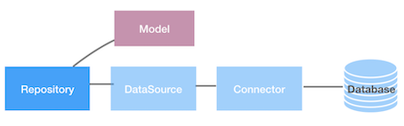

# Creating Repositories with the `lb4` CLI

The LoopBack documentation has a very good explanation of repositories. If something I write below doesn't make sense, or you just want to learn more, feel free to read them!

https://loopback.io/doc/en/lb4/Repository.html

---



The LoopBack documentation defines a Repository as " a specialized Service interface that provides strong-typed data access (for example, CRUD) operations of a domain model against the underlying database or service." Here, CRUD stands for Create, Read, Update, Delete.

In essence, a Repository defines the _actions_ that can be taken on your data, or the _beahvior_ of your data. This is in contrast to a Model, which defines the _shape_ of our data. It is a separation of concerns between two different areas of the appliaction. A Repository can filter data so that only a subset is returned, and it can change the shape of data that comes from the repository so that it fits the format that the Model (or the Controller) expects.

A model can also be serviced by multiple repositories, having different behavior deepending on the repository it is used with.

It should also be noted that a Repository is the component that talks to the DataSource, forming a bridge between the Model and (eventually) the database. It also talks to the Controller (that we will create in the following section).

For this workshop, you don't have to worry about any of this. We will be creating one Repository for each Model, and we will be using the `lb4` CLI for this creation. Just try to have a basic understanding of what the Repository is used for.

## Creating Repositories

So far, we have used the `lb4` CLI to create our application, to create our datasource, and to create our models. Let's use it to create our repositories as well! Simply run:

```
lb4 repository
```

You are again prompted with a number of questions:

```
? Select the datasource (Use arrow keys)
❯ LocalDatasource 
```

Because the repository connects to a DataSource, it will ask us which of our DataSources we want to use. Since we only have one DataSource, select whatever you named it a few sections back (something like `LocalDatasource`) and hit "Enter".

```
? Select the model(s) you want to generate a repository for (Press <space> to select, <a> to toggle 
all, <i> to invert selection, and <enter> to proceed)
❯◯ Author
 ◯ AuthorsBooks
 ◯ Book
 ◯ Customer
 ◯ Order
 ◯ OrdersBooks
```

Here you have to select all of the Models that you want to make a Repository for. I think it's worded sort of poorly, as it doesn't combine them to make one Repository, but makes Repository for each one you select. We want to make a Repository for each model, so press "a" to select them all, then press "Enter".

And voila! It should create one Repository for each of our Models:

```
   create src/repositories/author.repository.ts
   create src/repositories/authors-books.repository.ts
   create src/repositories/book.repository.ts
   create src/repositories/customer.repository.ts
   create src/repositories/order.repository.ts
   create src/repositories/orders-books.repository.ts

No change to package.json was detected. No package manager install will be executed.
   update src/repositories/index.ts
   update src/repositories/index.ts
   update src/repositories/index.ts
   update src/repositories/index.ts
   update src/repositories/index.ts
   update src/repositories/index.ts

Repositories AuthorRepository, AuthorsBooksRepository, BookRepository, CustomerRepository, OrderRepository, OrdersBooksRepository was/were created in src/repositories
```

If we look at one of these files, we can see that LoopBack created a TypeScript file for each repository, just defining some basic information:

```ts
import {inject, Getter} from '@loopback/core';
import {DefaultCrudRepository, repository, HasManyThroughRepositoryFactory} from '@loopback/repository';
import {LocalDataSource} from '../datasources';
import {Author, AuthorRelations, Book, BooksAuthors} from '../models';
import {BooksAuthorsRepository} from './books-authors.repository';
import {BookRepository} from './book.repository';

export class AuthorRepository extends DefaultCrudRepository<
  Author,
  typeof Author.prototype.id,
  AuthorRelations
> {

  public readonly books: HasManyThroughRepositoryFactory<Book, typeof Book.prototype.id,
          BooksAuthors,
          typeof Author.prototype.id
        >;

  constructor(
    @inject('datasources.local') dataSource: LocalDataSource, @repository.getter('BooksAuthorsRepository') protected booksAuthorsRepositoryGetter: Getter<BooksAuthorsRepository>, @repository.getter('BookRepository') protected bookRepositoryGetter: Getter<BookRepository>,
  ) {
    super(Author, dataSource);
    this.books = this.createHasManyThroughRepositoryFactoryFor('books', bookRepositoryGetter, booksAuthorsRepositoryGetter,);
    this.registerInclusionResolver('books', this.books.inclusionResolver);
  }
}
```

And that is all we have to worry about at this step. In the next step we will define Controllers that give a little more guidance to what our Repositories can do.

---
Next: [Creating LoopBack Controllers](h.loopback-controller.md)