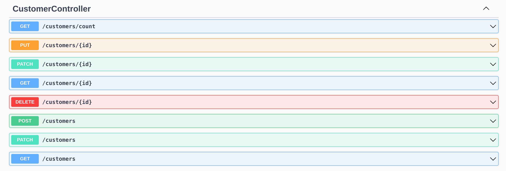
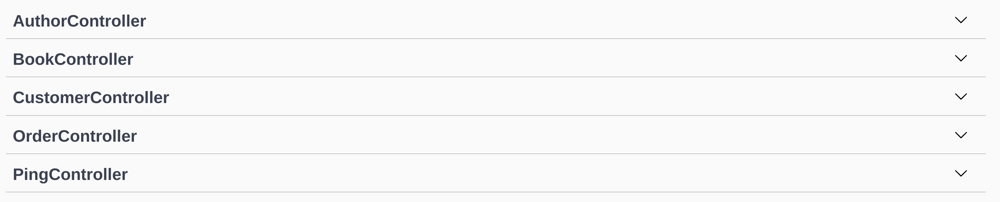

# Creating Controllers with the `lb4` CLI

The LoopBack documentation has a very good explanation of Controllers. If something I write below doesn't make sense, or you just want to learn more, feel free to read them!

https://loopback.io/doc/en/lb4/Controller.html

---

In LoopBack, the Controller is defined as "a class that implements operations defined by an application’s API. It implements an application’s business logic and acts as a bridge between the HTTP/REST API and domain/database models." Controllers are the TypeScript classes that expose everything else we've done up until now as endpoints for us to interact with.

For this workshop, we will simply be creating CRUD Controllers for all of our Models. This creates several endpoints for each Model, allowing us to do CRUD operations (Create, Read, Update, Delete), as well as some helper endpoints like `/count` to get the count of a particular model in the database.

To create these controllers we are again going to use the `lb4 CLI`. Run

```
lb4 controller
```

Unfortunately, unlike Repositories, we cannot create all of our Controllers at once, so we need to call it again and again for each of our main four models (**`Customer`**, **`Order`**, **`Book`**, and **`Author`**).

```
? Controller class name:
```

Here, we can simply put the same name as the Model that we are making the Controller for. If you are making a Controller for the **`Customer`** model, simply enter "Customer". When the Controller is created, LoopBack will actually name it **`CustomerController`**

```
? What kind of controller would you like to generate? (Use arrow keys)
❯ Empty Controller 
  REST Controller with CRUD functions
```

Select "Rest Controller with CRUD functions", otherwise we would have to implement the endpoints we want by hand!

```
? What is the name of the model to use with this CRUD repository?
```

Navigate down with the arrow keys and select **`Customer`**

```
? What is the name of your CRUD repository?
```

Again, navigate down and select **`CustomerRepository`**

```
? What is the name of ID property? (id)
```

We named all of our ID properties as `id`, and LoopBack knows this, so we can just press "Enter" to accept the default.

```
? What is the type of your ID? (Use arrow keys)
❯ number 
  string 
  object
```

All of our IDs are `numbers`, so just hit "Enter"

```
? Is the id omitted when creating a new instance? (Y/n)
```

All of our IDs are auto-generated, so we can just hit "Enter" to accept "Y" as the default.

```
? What is the base HTTP path name of the CRUD operations? (/authors) 
```

We can again accept the default, it is usually something sensible that LoopBack has come up with. If we want to change the URL of our REST API endpoints, now is a good time to change it to whatever you want!

And that's it, we have made a controller! After running the command for **`Customer`**, it your terminal should look like the following:

```
? Controller class name: Customer
Controller Customer will be created in src/controllers/customer.controller.ts

? What kind of controller would you like to generate? REST Controller with CRUD functions
? What is the name of the model to use with this CRUD repository? Customer
? What is the name of your CRUD repository? CustomerRepository
? What is the name of ID property? id
? What is the type of your ID? number
? Is the id omitted when creating a new instance? Yes
? What is the base HTTP path name of the CRUD operations? /customers
   create src/controllers/customer.controller.ts

No change to package.json was detected. No package manager install will be executed.
   update src/controllers/index.ts

Controller Customer was/were created in src/controllers
```

If you now run

```
npm run start
```

And navigate to the /explorer on your Port, should should see a 8 brand new REST API endpoints created under the CustomerController.



Now you have to do the exact same steps for the three remaining non-relation Models: **`Order`**, **`Author`**, and **`Book`**. Note that **we do not have to create Controllers for our other two models (`AuthorsBooks` and `OrdersBooks`)!**

When you are done, you should be able to run 

```
npm run start
```

and see in your /explorer that you have 5 Controllers (the ones you made, + the PingController).



And that's that! If you try to run and of those endpoints in the explorer, you will quickly notice that your system will throw back error HTTP status. We _still_ haven't created our database tables to back what we have done so far. But don't worry! We are very close. The last step before we migrate this all to Db2 for i is creating relations between our Models.

---
Next: [Creating LoopBack Relations](i.loopback-relations.md)