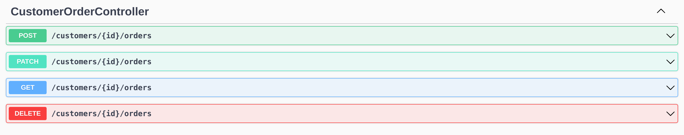
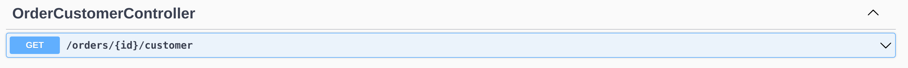
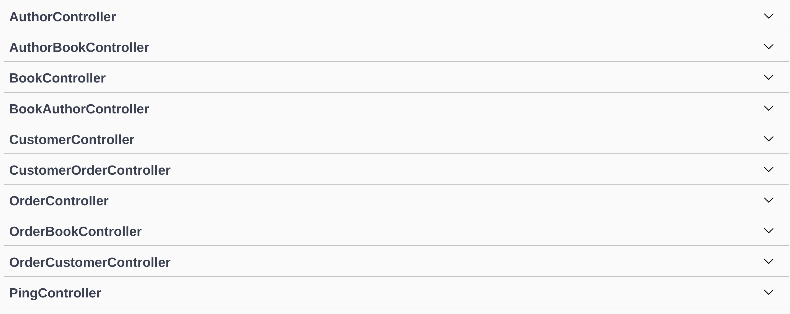

# Creating Relations with the `lb4` CLI

https://loopback.io/doc/en/lb4/Relations.html

Recall that we had defined several relationships between our Models that we needed to implement:

1. **`Customer`** has many **`Orders`**
2. **`Order`** has one **`Customer`**
3. **`Order`** has many **`Books`**
4. **`Books`** has many **`Authors`**
5. **`Authors`** has many **`Books`**

With our Models, Repositories, and Controllers all defined, we can now define these relationships. The relationships we create not only define how our data relates to one another, but it also affects the behavior of the endpoints that are created for our REST API.

As you might expect, we are going to create the relations with the `lb4` CLI. The only tricky part is understanding some of the terminology. The CLI will ask you for a `source ID` and a `target ID`. In our above list of relations for our data model, the `source` is the left column, and the `target` is the right column. In fact, lets rewrite that column using LoopBack terminology:

1. **`Customer`** hasMany **`Orders`**
2. **`Order`** belongsTo **`Customer`**
3. **`Order`** hasManyThrough **`Books`**
4. **`Books`** hasManyThrough **`Authors`**
5. **`Authors`** hasManyThrough **`Books`**

These are the relations we want to define. Lets run the CLI and walk through the output!

```
lb4 relation
```

It will walk you through the following prompts:

```
? Please select the relation type (Use arrow keys)
❯ belongsTo 
  hasMany 
  hasManyThrough 
  hasOne 
  referencesMany 
```

Based on the list of our relationships, lets select `hasMany`.

```
? Please select source model (Use arrow keys)
❯ Author 
  AuthorsBooks 
  Book 
  Customer 
  Order 
  OrdersBooks
```

Remember that in our list above, the **source** model is on the left, and the **target** model is on the right. So here, we are going to select `Customer`.

```
? Please select source model (Use arrow keys)
❯ Author 
  AuthorsBooks 
  Book 
  Customer 
  Order 
  OrdersBooks
```

In our list, the **target** model is on the right, so select `Order` to define this first relationship.

```
? Foreign key name to define on the target model (customerId)
```
What LoopBack is asking here is what on **`Order`** represents a **`Customer`**. When we defined our **`Order`** model, we gave it a `customerId` property. LoopBack is smart enough to guess that this is our foreign key, and give it to us as a default. Press "Enter" to accept it.

```
? Source property name for the relation getter (will be the relation name) (orders)
```
What property should be added to **`Customer`** to represent the list of **`Orders`**? Well, it suggests `orders`, and that seems reasonable to me! Hit "Enter" to accept this default.

```
? Allow Customer queries to include data from related Order instances?  (Y/n)
```
LoopBack wants to know, when we get a **`Customer`** from our REST API endpoints, should we be able to get **`Order`** information as well? I think that sounds like a good idea, so hit "Enter" to accept that default.

Your terminal should now have a summary of everything we just did, and should look something like this:

```
? Please select the relation type hasMany
? Please select source model Customer
? Please select target model Order
? Foreign key name to define on the target model customerId
? Source property name for the relation getter (will be the relation name) orders
? Allow Customer queries to include data from related Order instances?  Yes
   create src/controllers/customer-order.controller.ts

No change to package.json was detected. No package manager install will be executed.

Relation HasMany was/were created in src
```

For the relation that we create, it notes that we are given a new Controller (src/controller/customer-order.controller.ts). If we open run our application and open the explorer, we should see that we do indeed have an entirely new CustomerOrderController that allows us to retrieve all of the **`Orders`** of a **`Customer`** that we provide the id for.



We will play around with this in a bit. You can also go to the **`Customer`** TypeScript file (src/models/customer.model.ts) and see that a new relationship was added near the bottom the file:

```ts
@hasMany(() => Order)
  orders: Order[];
```

And with that, we have defined our first relationship! But lets walk through a few more, because different _types_ of relations can be very different paths through the CLI prompty.

Let's work on relation #2 (**`Order`** belongsTo **`Customer`**). Creating this relation will allow us to take an **`Order`** and retrieve information about the **`Customer`** who made that order. Again, start by calling

```
lb4 relation
```

Then follow the prompts. When its all done, it should look like

```
? Please select the relation type belongsTo
? Please select source model Order
? Please select target model Customer
? Foreign key name to define on the source model customerId
? Relation name customer
? Allow Order queries to include data from related Customer instances?  Yes
   create src/controllers/order-customer.controller.ts

No change to package.json was detected. No package manager install will be executed.

Relation BelongsTo was/were created in src
```

Although the relationship involves the same two models, the source and target model are switched, since we are defining a `belongsTo` instead of a `hasMany`. The rest of the answers should make sense, such as defining our foreign key and allowing **`Order`** queries to include data from related **`Customer`** instances.

Again, go start (or restart) your application with `npm run start` to rebuild it, then go to the explorer. You should see a new Controller called OrderCustomerController that has one endpoint. This endpoint allows us to get information about a **`Customer`** for an **`Order`**, if we know the id of the **`Order`**.



For our next relationships, the `hasManyThrough` type of relation indicates that there may be multiple source models on the target, and there may be multiple target models on the sources. To implement these relations, we created some intermediate or through models that track the foreign keys of both.

3. **`Order`** hasManyThrough **`Books`** -> **`OrdersBooks`** through model
4. **`Books`** hasManyThrough **`Authors`** -> **`AuthorsBooks`** through model
5. **`Authors`** hasManyThrough **`Books`** -> **`AuthorsBooks`** through model

Note that relations 4 and 5 can share a through model, since they are recording the same information just in different directions.

For each of these relations, call the CLI and walk through the steps, making your output look like the following:

```
? Please select the relation type hasManyThrough
? Please select source model Order
? Please select target model Book
? Please select through model OrdersBooks
? Foreign key name that references the source model to define on the through model orderId
? Foreign key name that references the target model to define on the through model bookId
? Source property name for the relation getter (will be the relation name) books
? Allow Order queries to include data from related Book instances?  Yes
   create src/controllers/order-book.controller.ts

No change to package.json was detected. No package manager install will be executed.

Relation HasManyThrough was/were created in src
```

```
? Please select the relation type hasManyThrough
? Please select source model Book
? Please select target model Author
? Please select through model AuthorsBooks
? Foreign key name that references the source model to define on the through model bookId
? Foreign key name that references the target model to define on the through model authorId
? Source property name for the relation getter (will be the relation name) authors
? Allow Book queries to include data from related Author instances?  Yes
   create src/controllers/book-author.controller.ts

No change to package.json was detected. No package manager install will be executed.

Relation HasManyThrough was/were created in src
```

```
? Please select the relation type hasManyThrough
? Please select source model Author
? Please select target model Book
? Please select through model AuthorsBooks
? Foreign key name that references the source model to define on the through model authorId
? Foreign key name that references the target model to define on the through model bookId
? Source property name for the relation getter (will be the relation name) books
? Allow Author queries to include data from related Book instances?  Yes
   create src/controllers/author-book.controller.ts

No change to package.json was detected. No package manager install will be executed.

Relation HasManyThrough was/were created in src
```

These `hasManyThrough` relations allow us to basically do the same thing as the other relations we defined: Given an **`Order`**, retrieve all of the **`Books`** for it; Given a **`Book`**, retrieve all of its **`Authors`**; Given an **`Author`**, retrieve all of their **`Books`**.

And with those relations defined, our work defining our data should be completely **FINISHED!**. If you restart your LoopBack application, you should now see that you have all sorts of Controllers exposing endpoints that allow us to get all of the information we need to run Benelux Books.



Now, its finally time to take the entire data model we have been defining for the last several sections, and create databse tables for everything!

---
Next: [Migrating our Models](j.loopback-migration.md)