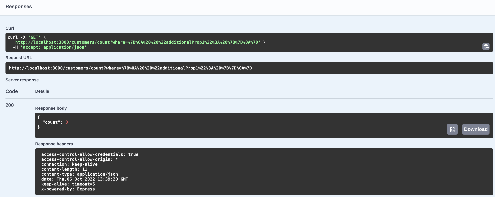
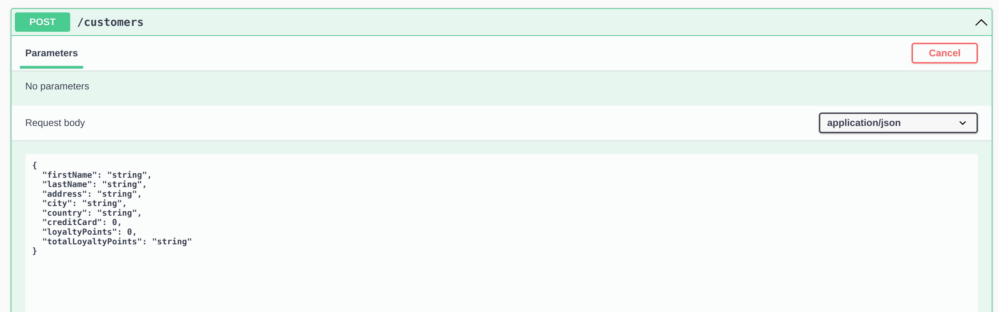

# Migrating our Models to Db2 for i (not with the `lb4` CLI)

The time has finally come: We have created our LoopBack application, generated a datasource, defined our models, created our repositories and controllers, defined our relations, and now we can finally migrate our entire data model to Db2 for i tables!

Migration used to require us to write our own TypeScript function to achieve this. Luckily, there is now a helpful script we can run to do migration. Note that we aren't going to be using the `lb4` CLI, but a script that is found in the `package.json` file (called `"migrate"`, that runs `node ./dist/migrate`).

When you run this script, LoopBack use its knowledge of Db2 for i (because of the `loopback-connector-ibmi` we downloaded when making our datasource) and try to create tables in the default schema for your user profile. For your workshop profiles, I have created a schema for each of you, and your tables will be created there. It will create the tables with a name that mirrors the name of each model.

---
**IMPORTANT**: When you run this script, it tries to delete all of the schemas that you have access to. I have tried to stiffle this behavior as much as I possibly can, but **it is still possible it will try to do this. If you have `*ALLOBJ* special authority, this means it could destroy your system!!!** Please make sure that you always run LoopBack on a profile that has very limited profile, I don't want to be responsible for anything bad happening!
---
---

Ok, with that out of the way, lets look at the tables in our schema first. You can open up Access Client Solutions (ACS), or any other way that you have to access the database, and run a query like:

```
SELECT * FROM SYSIBM.SQLTABLES WHERE TABLE_SCHEM = 'USERNAMEXX' AND TABLE_TYPE = 'TABLE'
```
Where you replace `USERNAMEXX` with the name of your user profile. You should get 0 results back, indicating there are no tables in our database.

Now its time for the magic! Run

```
npm run migrate
```

and wait for the script to finish (it shouldn't take very long). While its running it should say

```
Migrating schemas (alter existing schema)
```

Once it finishes and gives you back a prompt, you can run your SQL query again. Because we have 6 models that you migrated, you should now see that you have 6 tables created in your schema! And our REST API endpoints are hooked up to them!

## Trying out our new tables

Our REST APIs should now be backed up by our database tables, being sent over the ODBC connections that we have defined in our DataSource. Open up the explorer in your broswer again (oursystem:30XX/explorer) and try the endpoints out!

If you go to a endpoint, like `[GET] /customers/count`, you should be able to expand it by clicking on it, then press "Try it out" in the upper-right hand corner. These `/count` endpoints will just return the number of instances of that model that are present in the database. You don't need to pass in any data, so you can just press the blue "Execute" button on that panel. When you do, _it will actually call your REST API, which will call the database to get the count of records in the backing table, and return a real response to you in JSON format from your REST API!_

After clicking "Execute", it should return something like the following:



It will tell you _exactly_ how many records in our database (in our case, 0), in an easy to read (and easy to parse) format, a JSON object with one property, `"count"`. Also importantly, on the left-hand side, it will give you the HTTP response code, in this case 200 (The OK response code, indicating success). If you see a response code and want to know what it means, consult the Mozilla docs on HTTP response codes: https://developer.mozilla.org/en-US/docs/Web/HTTP/Status

For now, lets create an instance of a Customer in our data model. Again, this will be propogated to the Db2 for i database table backing our REST API. For creating instances of a model, we use the `[POST]` HTTP method. Find the `[POST] /customers` API in the explorer and expand it. Then click "Try it out". It will give you a pane with some JSON that you can edit. This is the same JSON that is sent as the payload to your endpoint.



Notice that the values it gives you aren't very interesting. All of our `string` variables are defaulted to `"string"`. Let's change them to make the data in our database much more interesting. The values I entered were:

```json
{
  "firstName": "Mark",
  "lastName": "Irish",
  "address": "123 Fake Street",
  "city": "Rochester, MN",
  "country": "USA",
  "creditCard": 123456789,
  "loyaltyPoints": 0,
  "totalLoyaltyPoints": 0
}
```

Feel free to put whatever you want. Then, once you have interesting values, then hit the blue "Execute" button. If everything goes well, you should get a 200 code returned, along with all of the information you passed in _AND_ whatever the auto-generated ID is. This is how we identify this record when we query information about it (or update or delete it). The values I was returned were:

```json
{
  "id": 1,
  "firstName": "Mark",
  "lastName": "Irish",
  "address": "123 Fake Street",
  "city": "Rochester, MN",
  "country": "USA",
  "creditCard": 123456789,
  "loyaltyPoints": 0,
  "totalLoyaltyPoints": 0
}
```

Tada! We now have structered access to our business domain objects that are stored in our database! We have easy to use REST APIs that can be exposed to all of our applications to run our business, and instead of all of them making direct queries, we can abstract all of that behind these simple to use endpoints!

That is so cool! And it is a very "normal" thing to do in business! These REST API endpoints are going to be the backbone of your hackathon application.

## Discovery

In this workshop, we have create our models by hand and migrated them into the database. It is also possible (and maybe more interesting for IBM i shops) to "discover" models that already exist in the database. This is called discovery, and uses the CLI command `lb4 discover`. In this way, you can make REST API endpoints to access already existing database tables and data.

For this workshop, I thought it was important that you understood what all of the different parts of a LoopBack application were, so we went the other way, LoopBack -> Db2 for i. If discovery is something that interests you, feel free to consult the documentation:

https://loopback.io/doc/en/lb4/Discovering-models.html


## Securing our Endpoints

We now have REST API endpoints that give us access to the underlying database, allowing us to do CRUD operations on data in those tables (through the Model defintions we created). The last step is to secure our REST API endpoints to make sure that not just anyone can access their data.

---
Next: [HTTPS](k.https.md)